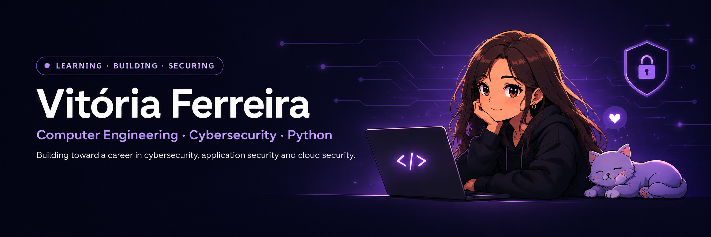

## Hi, I'm Vitória 👋

Computer Engineering student exploring cybersecurity, software development, Linux and cloud technologies.

> Building toward a career in cybersecurity, application security and cloud security.

Currently learning: Java, Python, SQL, Linux and cloud fundamentals. 
Building toward: Application Security, DevSecOps and Cloud Security.

  
  
  
  

### 🎧 Currently playing

### My Tech Journey

#### Learning now

Java · Python · SQL · Linux · Git

  

#### Next on my roadmap

Spring Boot · PowerShell · Docker · Azure · AWS · Go

  

#### Long-term focus

C#/.NET · C · Rust · Kubernetes · Terraform 
Security focus: Application Security · DevSecOps · Cloud Security · Identity and Access Management

  

### 💣 My contribution graph

  

